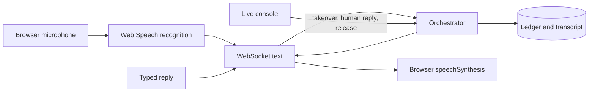
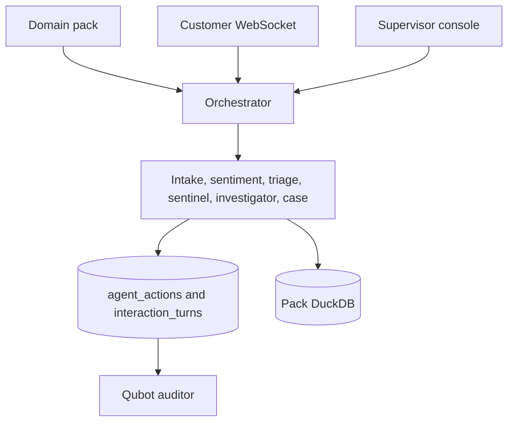

# Skew AI

Skew AI is a single-tenant pilot for live customer contacts. A **domain pack** (YAML + CSV) supplies the questions, safety rules, and known issues. The same agents then run the contact, write an audit ledger, and hand a supervisor a live console.

The product name is Skew AI (`skewai`). API paths and environment variables still use `frontline` (`/api/frontline/*`, `FRONTLINE_*`).

Two packs ship with small offline fixtures (10 records, 2 advisories, 3 clusters each):

| Pack | Use it for |
|---|---|
| `automotive_nhtsa` | Vehicle year, make, model, and system. VIN capture runs only on this pack. |
| `finance_cfpb` | Account products and fees. A 17-digit account number stays on the finance path. |

`consumer_cpsc` and `medical_maude` are on disk for experiments. They are not the seeded demo packs. `_template` is a scaffold.

## Start a local pilot

Requirements: Python 3.11+, Node 20+, and a Chrome-family browser if you want microphone recognition.

```bash
python -m venv .venv
source .venv/bin/activate
pip install -r requirements.txt -c requirements-lock.txt
cp .env.example .env
# Local only: leave FRONTLINE_API_KEY empty, or set FRONTLINE_OPEN_MODE=1
make frontline-db
make pack-lint PACK=automotive_nhtsa
```

Terminal 1 — API:

```bash
uvicorn src.api.main:app --reload --port 8000
```

Terminal 2 — dashboard (proxies `/api` and `/ws` to port 8000):

```bash
cd dashboard && npm install && npm run dev
```

Open [http://127.0.0.1:8787/ui/](http://127.0.0.1:8787/ui/). Health check: [http://127.0.0.1:8000/health](http://127.0.0.1:8000/health). `/health` reports `single_worker: true`. Keep it that way. Live calls live in this process.

Without a microphone:

```bash
make contact          # one scripted text contact
make simulate N=25    # replay fixture records as contacts
make eval-frontline   # offline gates for both shipped packs
```

### Docker

```bash
# Open local pilot. API and dashboard: http://127.0.0.1:8000/ui/
docker compose --profile open up --build

# Auth-required pilot. Set FRONTLINE_API_KEY and SESSION_SECRET in .env first.
# Host port 8001 so it does not collide with the open profile.
docker compose --profile hardened up --build
```

Run one API container. Extra workers do not share the live-call registry.

## Work a live contact

1. **Voice agent** (`#call`). Start a call. Chrome asks for the microphone and for speech recognition. The greeting is spoken in the browser.
2. Speak, or type in the box. The server receives text. It does not receive audio.
3. **Live console** (`#console`) lists active contacts. Take over, type a reply, then release. The first supervisor to claim the call is the only one who can send or release it. A second claim returns 409.
4. After release, the AI continues from the facts collected so far.
5. End the call from the widget, or let the orchestrator close it. The closing line is spoken before the widget tears the call down. Hangup stops speech immediately.

If recognition is denied or missing, the status reads **Text only** and the text box still works. Use **Try microphone again** after you change the browser permission. Mute stops recognition and does not send speech until you unmute.

A dropped socket in the same page can resume for `FRONTLINE_WS_RECONNECT_GRACE_S` seconds (default 120). A full page refresh does not restore the call. An API restart marks the in-memory call failed; stored turns remain.

## What the voice path does



| Stage | What is true |
|---|---|
| Recognition and speech | Happen in the browser. Safari and Firefox are not the supported path. |
| Server input | Final text, plus barge-in timing for the utterance that was playing. |
| Ordinary replies | A ledger action is written, then the transcript row, then the text is sent. |
| Takeover | The widget cancels queued AI audio. Later supervisor replies still play. |
| Barge-in | The audit records an estimated prefix of the utterance the caller was hearing. |
| Goodbye | Plays through, then the widget releases the microphone. |

Switch packs from **Settings**, or set `DOMAIN_PACK` before startup. Finance and automotive share the voice widget. VIN checks run only for the automotive pack.

## Roles

Signed sessions carry the role. A shared API key is the `service` principal. Open mode stays on `agent`.

| Role | Live call | Console |
|---|---|---|
| `agent` | Can start and speak as the customer widget | Sees activity with supervisor message text removed |
| `supervisor` | Can take over, reply, and release | Full live console |
| `auditor` | Read and audit routes | Cannot attach to a customer socket or hang up |
| `admin` | Includes an explicit audited override for release | Full access |

Customer sockets require `contact:write`. A session that names a contact can attach only to that contact. Put the API key in the dashboard sign-in (memory by default). WebSockets authenticate with a first message, not `?api_key=` in the URL.

For any shared network set `FRONTLINE_AUTH_REQUIRED=1`, a long `FRONTLINE_API_KEY`, and a distinct `SESSION_SECRET`.

## Dashboard

The dev server and the Docker UI are both mounted at `/ui/`.

| Page | Hash | Use it to |
|---|---|---|
| Command center | `#command` | See whether contacts are moving |
| Voice agent | `#call` | Place the customer call |
| Live console | `#console` | Claim, reply, release |
| Case queue | `#cases` | Read and update cases after close |
| Early warning | `#warning` | Watch clusters and investigations |
| Trust | `#audits` | Read Qubot audits |
| Settings | `#settings` | API key, active pack, alert webhook |

Enterprise Ops, Platform, Insights, and Pack Builder are extra surfaces on the same API. They read the warehouse. They do not place the live call.

## Commands

| Command | Result |
|---|---|
| `make frontline-db` | Rebuild the local ops database and fixture domain databases. Destructive. Requires the reset flag in `.env.example`. |
| `make seed-domains` | Fixture domain databases only |
| `make pack-lint PACK=automotive_nhtsa` | Validate a pack |
| `make contact` | One deterministic text contact |
| `make simulate N=25` | Replay fixture contacts |
| `make audit ID=int_…` | Re-run Qubot on one contact |
| `make verify-chain ID=int_…` | Check the hash-chained ledger |
| `make eval-frontline` | Offline eval for both shipped packs, in a temp database |
| `make test` | `tests/frontline/` in a temp database |
| `make pack-init SRC=file.csv PACK=my_pack` | Draft a pack from CSV. Review the mapping before lint. |

Audit export: `GET /api/frontline/audits/export?start=YYYY-MM-DD&end=YYYY-MM-DD`.

Optional narration uses `src/ai/` only when `FRONTLINE_LLM_ENABLED=1` and a provider key is set. The default path is deterministic and does not call a model.

## How a contact is decided



States move from greeting, through collection, and into enrichment, closing, and done. Safety language can escalate. A supervisor claim moves the contact to supervised and stops new AI speech. Release recomputes the next state from the facts on the contact.

Every ordinary customer-visible line is ledgered before it is sent. A failed transcript insert is not treated as an accepted turn. Qubot later checks that cited evidence IDs exist. That check runs after the call. It does not hold each sentence until a second review finishes.

## Layout

| Path | What lives there |
|---|---|
| `domains/<pack_id>/` | Pack YAML, gazetteers, fixtures |
| `src/agents/` | Orchestrator and the six agents |
| `src/api/routes/interactions.py` | Contact REST and the voice and console sockets |
| `src/channels/web_voice.py` | Browser voice frames |
| `src/ledger/` | Hash-chained action log |
| `src/qubot/` | Post-contact auditor |
| `dashboard/routes/CallWidget.jsx` | Voice agent |
| `dashboard/routes/LiveContactConsole.jsx` | Supervisor console |
| `tests/frontline/` | API, agent, and voice regressions |
| `docs/frontline_architecture.md` | Longer design note |
| `docs/domain_pack_guide.md` | How to add a vertical |
| `docs/demo_script.md` | Demo beats for both packs |

## Operating limits

- One API process owns live sockets, takeover, and the reconnect grace. PostgreSQL or another database does not, by itself, make calls survive a crash or a second worker.
- The browser performs recognition and speech. A quiet room, a denied permission, or a browser without Web Speech means the caller must type.
- Fixture corpora are 10 records per shipped pack. Names like NHTSA and CFPB describe the pack shape, not a full public dump in this repo.
- This pilot is one installation. It is not a multi-tenant control plane, a telephony carrier, or a CRM sync. The outbound connector writes JSON and can POST it. It does not speak Salesforce, ServiceNow, or Zendesk.
